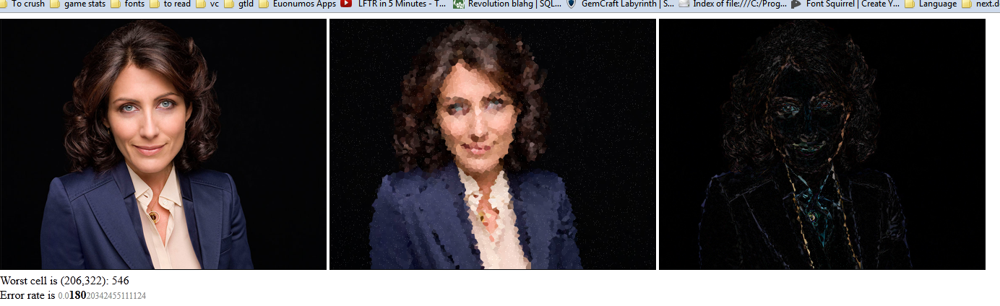
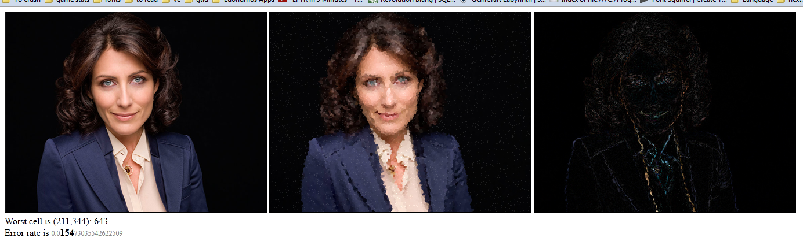
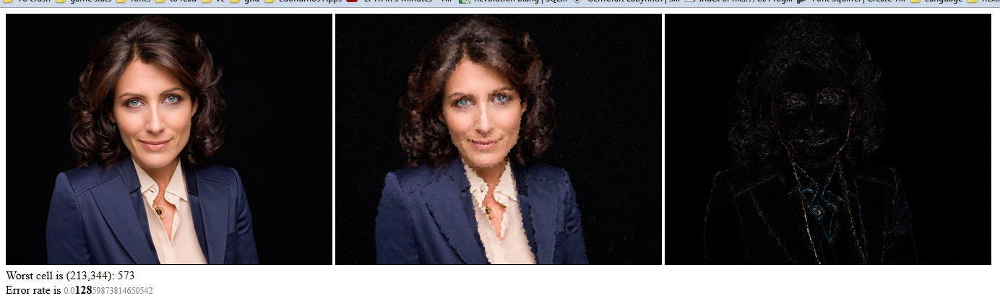
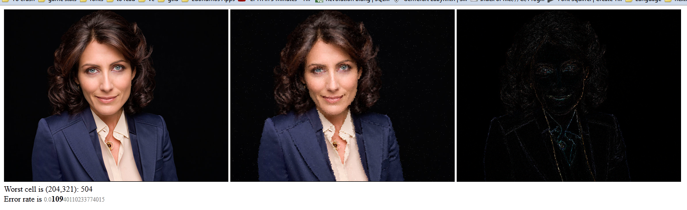

vorcoder
========

Voronoi image encoder in JS.

This thing is hilariously slow.

Huh?
----

This is just a toy, really: it scatters N points randomly on an image, then makes voronoi cells over the points, then fills the cell with the average color of the pixels in the cell.

The notion is that labelling those points with that color could make a cheesy image compressor.  Except I forgot that I'm lazy.

No, seriously.  Huh?
--------------------

Lisa Edelstein at 10,000 cells:

Lisa Edelstein at 16,000 cells:

Lisa Edelstein at 28,000 cells:

Lisa Edelstein at 50,000 cells:

Polemic :neckbeard:
-------------------

`vorcoder` is MIT licensed, because viral licenses and newspeak language modification are evil.  Free is ***only*** free when it's free for everyone.
